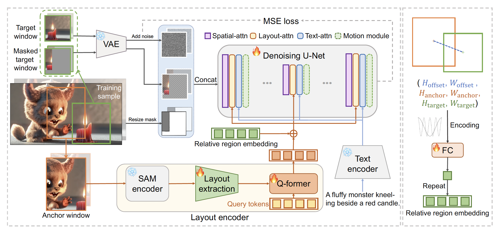

<div align="center">
<h2><font color="red"> Follow-Your-Canvas 🖼 : </font></center> <br> <center>Higher-Resolution Video Outpainting with Extensive Content Generation</h2>

[Qihua Chen*](https://scholar.google.com/citations?user=xjWP9gEAAAAJ&hl=en), [Yue Ma*](https://github.com/mayuelala), [Hongfa Wang*](https://scholar.google.com.hk/citations?user=q9Fn50QAAAAJ&hl=zh-CN), [Junkun yuan*✉️](https://scholar.google.com/citations?user=j3iFVPsAAAAJ&hl=zh-CN), 

[Wenzhe Zhao](https://github.com/mayuelala/FollowYourCanvas), [Qi Tian](https://github.com/mayuelala/FollowYourCanvas), [Hongmei Wang](https://github.com/mayuelala/FollowYourCanvas),[Shaobo Min](https://github.com/mayuelala/FollowYourCanvas), [Qifeng Chen](https://cqf.io), and [Wei Liu✉️](https://scholar.google.com/citations?user=AjxoEpIAAAAJ&hl=zh-CN)

<a href='https://arxiv.org/abs/2304.01186'></a> 
<a href='https://follow-your-canvas.github.io/'></a>    [](https://github.com/mayuelala/FollowYourCanvas) 
</div>

## 📣 Updates

- **[2024.09.18]** 🔥 Release `training/inference code`, `config` and `checkpoints`!
- **[2024.09.07]** 🔥 Release Paper and Project page!


## 📋 Introduction


Follow-Your-Canvas enables higher-resolution video outpainting with rich content generation, overcoming GPU memory constraints and maintaining spatial-temporal consistency.




## 🛠️ Environment
Before running the code, make sure you have setup the environment and installed the required packages.
Since the outpainting window is 512*512*64 each time, you need a GPU with at least 60G memory for both training and inference.
```bash
pip install -r requirements.txt
```
Download our checkpoints [here](https://drive.google.com/file/d/1CIiEYxo6Sfe0NSTr14_W9gSKePVsyIlQ/view?usp=drive_link).  

You also need to download [[sam_vit_b_01ec64](https://github.com/facebookresearch/segment-anything/tree/main?tab=readme-ov-file#model-checkpoints)], [[stable-diffusion-2-1](https://huggingface.co/stabilityai/stable-diffusion-2-1)], and [[Qwen-VL-Chat](https://huggingface.co/Qwen/Qwen-VL-Chat)].

Finally, these pretrained models should be organized as follows:
```text
pretrained_models
├── sam
│   └── sam_vit_b_01ec64.pth
├── follow-your-canvas
│   └── checkpoint-40000.ckpt
├── stable-diffusion-2-1
└── Qwen-VL-Chat
```
## 🏆 Train

We also provide the training code for Follow-Your-Canvas. In our implementation, eight NVIDIA A800 GPUs are used for training (50K steps). 
First, you should download the [Panda-70M](https://snap-research.github.io/Panda-70M/) dataset. Our dataset (animatediff/dataset.py) needs a csv which contains the video file names and prompt. 
```bash 
# config the csv path and video path in train_outpainting-SAM.yaml
torchrun --nnodes=1 --nproc_per_node=8 --master_port=8888 train.py --config train_outpainting-SAM.yaml
```

## 🚀 Inference

We support outpaint with and without prompt (where the prompt will be genrated by Qwen).

```bash
# outpaint the video in demo_video/panda to 2k with prompt 'a panda sitting on a grassy area in a lake, with forest mountain in the background'.
python3 inference_outpainting-dir.py --config infer-configs/infer-9-16.yaml
# outpaint the video in demo_video/polar to 2k without prompt.
python3 inference_outpainting-dir-with-prompt.py --config infer-configs/prompt-panda.yaml
```
The result will be saved in /infer.

## 🏆 Evaluation

We evaluate our Follow-Your-Canvas on the DAVIS 2017 dataset. [Here](https://drive.google.com/file/d/1u4I9ca35mNIG4b1b8aZaHn6nmGrITw7e/view?usp=sharing) we provide the input for each experimental settings, gt videos and our outpainting results. 
The code for PSNR, SSIM, LPIPS, and FVD metics is in /video_metics/demo.py and fvd2.py. To compute aesthetic quality (AQ) and imaging quality (IQ) from V-Bench:
```bash
cd video_metics
git clone https://github.com/Vchitect/VBench.git
pip install -r VBench/requirements.txt
pip install VBench
# change the video dir in evaluate-quality.sh
bash evaluate-quality.sh
```

## 👨‍👩‍👧‍👦 Follow Family
[Follow-Your-Pose](https://github.com/mayuelala/FollowYourPose): Pose-Guided text-to-Video Generation.

[Follow-Your-Click](https://github.com/mayuelala/FollowYourClick): Open-domain Regional image animation via Short Prompts.

[Follow-Your-Handle](https://github.com/mayuelala/FollowYourHandle): Controllable Video Editing via Control Handle Transformations.

[Follow-Your-Emoji](https://github.com/mayuelala/FollowYourEmoji): Fine-Controllable and Expressive Freestyle Portrait Animation.

[Follow-Your-Canvas](https://github.com/mayuelala/FollowYourCanvas): High-resolution video outpainting with rich content generation.

## 💗 Acknowledgement

We acknowledge the following open source projects.

[AnimateDiff](https://github.com/guoyww/AnimateDiff) &#8194; 
[VBench](https://github.com/Vchitect/VBench) &#8194;

## ✅ Citation
If you find Follow-Your-Canvas useful for your research, welcome to 🌟 this repo and cite our work using the following BibTeX:
```bibtex

```

